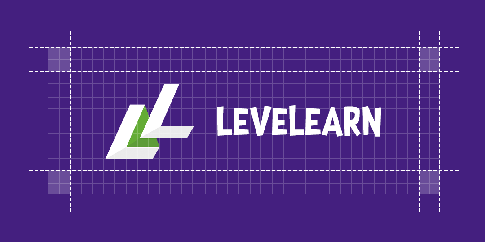
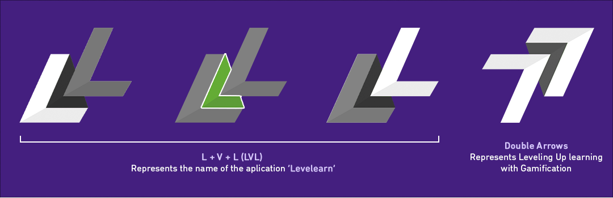

# Levelearn - Human Centered Gamified Learning Platform  

Selamat datang di organisasi GitHub **Levelearn**! Organisasi ini didedikasikan untuk menyimpan dan mengelola kode yang dikembangkan dalam penelitian kami yang berjudul:

**"Pendekatan Gamifikasi berbasis Preferensi Pengguna untuk Optimalisasi Pengalaman Pengguna pada E-Learning"**

Penelitian ini bertujuan untuk meningkatkan pengalaman pengguna pada aplikasi pembelajaran mobile melalui penerapan elemen gamifikasi yang disesuaikan dengan preferensi pengguna.

## Ringkasan Penelitian

Penelitian ini terdiri dari tiga fase utama, dan kode untuk setiap fase akan dikelola dalam repositori yang berbeda di organisasi ini:

1.  **Pengumpulan Data Preferensi Pengguna:**
    * Menggunakan metode *Direct Elicitation Preference* (DPE) untuk mengumpulkan data preferensi pengguna terkait elemen gamifikasi.
    * Analisis data dilakukan untuk mengidentifikasi preferensi gamifikasi yang dominan.
    * Kode dan analisis data terkait fase ini dapat ditemukan di repositori **data-analysis**.

2.  **Pengembangan Aplikasi E-Learning Berbasis Preferensi Gamifikasi:**
    * Mengembangkan aplikasi e-learning mobile yang mengimplementasikan elemen gamifikasi berdasarkan preferensi pengguna yang diperoleh dari fase pertama.
    * Pengembangan meliputi berbagai lapisan:
        * **Mobile Development:** Aplikasi mobile akan dibangun menggunakan **Flutter/Dart** (repositori **mobile**).
        * **Web Development:** Antarmuka web pendukung (jika ada) akan dibangun menggunakan **ReactJS** (repositori **frontend-web**).
        * **Backend Development:** Logika bisnis dan manajemen data akan diimplementasikan menggunakan **Node.js, Express.js, Prisma, dan MySQL** (repositori **backend**).
        * **Deployment:** Seluruh aplikasi akan di-deploy menggunakan **Docker** (konfigurasi Docker terdapat di repositori **backend** dan **frontend-web**).

3.  **Evaluasi Pengalaman Pengguna:**
    * Mengevaluasi dampak penerapan gamifikasi berbasis preferensi pengguna terhadap pengalaman pengguna aplikasi e-learning.
    * Pengukuran pengalaman pengguna akan menggunakan **HEART Framework**.
    * Pengumpulan dan analisis data evaluasi akan dilakukan.
    * Kode dan analisis data terkait fase ini juga akan disimpan di repositori **data-analysis**.
  

## Repositori

Organisasi ini memiliki repositori berikut:

* **backend:** Berisi kode sumber untuk backend aplikasi e-learning.
    * Teknologi: Node.js, Express.js, Prisma, MySQL, Docker.
* **mobile:** Berisi kode sumber untuk aplikasi mobile e-learning.
    * Teknologi: Flutter, Dart.
* **frontend-web:** Berisi kode sumber untuk antarmuka web (jika ada).
    * Teknologi: ReactJS, Dockerfile.
* **data-analysis:** Berisi *notebook* Jupyter (ipynb) dan file-file lain yang digunakan untuk analisis data pada fase pengumpulan preferensi pengguna (DPE) dan evaluasi (HEART Framework).

Pastikan Anda membaca dokumentasi dan petunjuk penggunaan yang lebih rinci pada masing-masing repositori.

## Tim Penelitian TA-2024/2025-13

* **Archico Sembiring** (11S21011)
* **Benhard Yuda** (11S21003)
* **Rafael A. C. Manurung** (11S21028)

**Dosen Pembimbing:** Ranty Deviana Siahaan, S.Kom., M.Eng

## Kontribusi

Organisasi ini bersifat privat untuk tim penelitian TA-2024/2025-13. Kontribusi eksternal saat ini tidak dibuka.

## Lisensi

Lisensi proyek ini akan ditentukan kemudian.

## Kontak

Untuk pertanyaan lebih lanjut, silakan hubungi salah satu anggota tim atau dosen pembimbing.

---

**Terakhir diperbarui:** 1 April 2025
